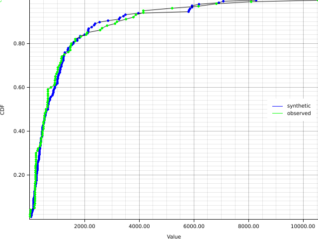

# Reservoirs - A library for modeling Bolin & Rodhe reservoirs.
Bolin & Rodhe (1973) describe methods for characterizing the turnover rate of mass accumulating in a reservoir.
The distribution of ages of particles in the reservoir constrain the possible input and output rates that could
produce the observed record.  The functions in this crate allow the user to compare synthetic accumulation records to
observed records using the K-S and Kuiper statistics, to determine the best-fitting input/output pair for an observed record.

In my research at Oregon State University, I estimate the transit times of stream sediments moving through headwater valleys
of the Coast Range by fitting reservoir models to a record of charcoal ages sampled from stream bank deposits.  Inherited age
refers to the age of charcoal when it enters a stream deposit.  If we do not account for inherited age in the model, then transit times
become artificially inflated.  I have added an inherited age capacity to reservoirs, and while this is not a traditional feature
of Bolin & Rodhe reservoirs, it is useful for dealing with charcoal ages.

This library includes the full code base used to estimate transit times for my ongoing dissertation, published here in the interest
of academic transparency.

 - Please direct questions, comments or insults to the [github repository](https://github.com/crumplecup/reservoirs).
 - View the crate documentation on [docs.rs](https://docs.rs/reservoirs/).

 ## Quick Start

To use reservoirs, add it to your `Cargo.toml`
```toml
[dependencies]
reservoirs = "^0.1.5"
```

Let's load the stream bank charcoal data from the Oregon Coast that I use 
in my research.  Many of the functions serve to compare a synthetic distribution 
against an observed record, and stream bank charcoal makes a handy foil.

```rust
use reservoirs::prelude::*;

fn main() -> Result<(), ResError>{
    // mean expected deposit age and inherited age by facies
    let dep = Sample::read("https://github.com/crumplecup/reservoirs/blob/master/examples/dep.csv")?;
    let iat = Sample::read("https://github.com/crumplecup/reservoirs/blob/master/examples/iat.csv")?;

    // subset mean ages of debris flows
    let df: Vec<f64> = dep.iter()
        .filter(|x| x.facies == "DF")
        .map(|x| x.age)
        .collect();
    // subset inherited ages
    let ia: Vec<f64> = iat.iter()
        .map(|x| x.age)
        .collect();

    // create steady state reservoir with charcoal inherited ages
    let res = Reservoir::new().input(&0.78)?
        .output(&0.78)?
        .inherit(&ia);
    // sample a stereotypical record from 1000 runs of 30000 years
    let eg = res.stereotype(&30000.0, 1000, 200);
    // compare the CDF of the synthetic example to the observed debris-flow deposit record
    plot::comp_cdf(&eg, &df, "examples/df_cdf.png");

    Ok(())
}

```
